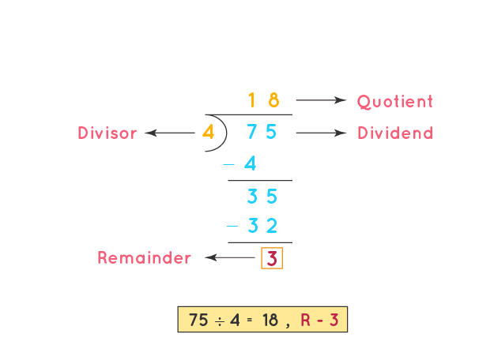

# Division

Key terms

- Divident
- Divisor
- Quotient
- Remainder

## Divisibility Rule

Two (2)

- Number must be even

Three (3)

- add all digits of number and check if the added value is divisible by 3.
- 756 = 7 + 5 +6 = 18 and 18 is divisible by 3. Thus 756 is divisible by 3.

Four (4)

- Last 2 digits of number must be either 00 or divisible by 4.
- 7928 has last 2 digits = 28 and 28 is divisible by 4. Thus 7928 is divisible by 4.
- 62900 has last 2 digits = 00. Thus it is divisible by 4.

Five (5)

- Number must end with either 0 or 5.

Six (6)

- Number must be divisible by both 2 and 3.
- 756 - is an even number, so divisible by 2. - 7 + 5 +6 = 18 and 18 is divisible by 3.
  Thus 756 is divisible by 6.

Seven (7)

- step 1 - Take last digit of number and multiply it with 2.
- step 2 - Take the original number and remove it's last digit.
- step 3 - Now subtract number calculated in step 1 from obtained in step 2.
- step 4 - If number calculated in step 3 is divisible by 7, then original number is divisible by 7.

example

- $798$
- step 1 - $8 \times 2 = 16$
- step 2 - 79 is obtained by removed 8 from 798.
- step 3 - $79-16 = 63$
- step 4 - 63 is divisible by 7.

  Therefore 798 is divisible by 7.

Eight (8)

- Last 3 digits of number are divisible by 8.
- 93328 - last 3 digits of number = 328 and 328 is divisible by 8.

Nine (9)

- Number must be divisible by 3 for 3-times.

Ten (10)

- Number must end with 0

## Division using Fractions

$$ \frac {numerator} {denominator} $$

Steps:

1. Find the common factor for both numerator and denominator.
2. Divide both numerator and denominator with common factor and replace values with quotients.
   Now we have new values for numerators and denominators.
3. Repeat step 1 and 2, until there is no-common factor left for numerator and denominator.

#### Example

$$ \frac {243} {27} $$

step 1 - Using divisibility rule to find common factor

- checking for 2
  - Because 243 and 27 are odd numbers, these numbers cannot be divided by 2.
- checking for 3
  - 243 = 2 + 4 + 3 = 9 and 9 is divisible by 3.
  - 27 = 2 + 7 = 9 and 9 is divisible by 3.
    Therefore both numbers are divisible by 3.

step 2 - Dividing both numerator and denominator with common factor 3 and get new values of numerator and denominator.

$$ \frac {243} {27} $$
$$ 243 / 3 = 81 $$ $$ 27 / 3 = 9 $$
$$ \frac {81} {9} $$

step 3 - Repeating step 1 and 2, we found another common factor 3
$$ \frac {81} {9} $$
    $$ 81 / 3 = 27 $$ $$ 9 / 3 = 3 $$
    $$ \frac {27} {3} $$

- Again, Repeating step 1 and 2, we found another common factor 3
  $$ \frac {27} {3} $$
    $$ 27 / 3 = 9 $$ $$ 3 / 3 = 1 $$
    $$ \frac {9} {1} $$  
   $$ 9 $$ is the answer.
